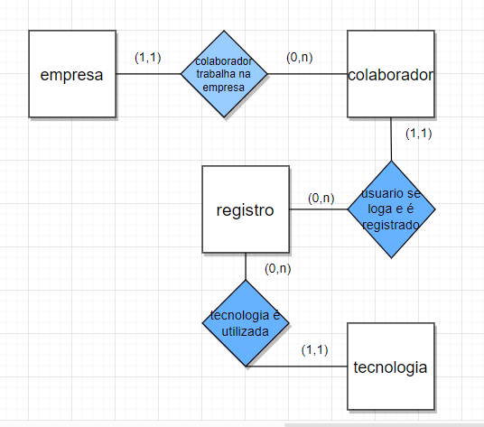
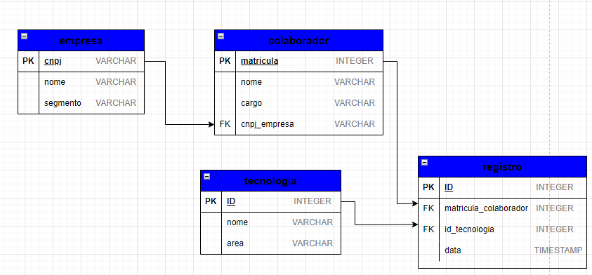

# modelo_de_banco_de_dados

Foi solicitado a criação de um banco de dados com o objetivo de analisar as tecnologias utilizadas pelas empresas e seus colaboradores. Para isso, optou-se por criar um modelo relacional com a intenção de obter insights a partir dos dados coletados.

Antes de criar um banco de dados, é fundamental desenvolver um modelo de banco de dados. O primeiro passo foi a criação do modelo conceitual, levando em consideração os relacionamentos e a cardinalidade das entidades.

## modelo conceitual

após isso o modelo passou por melhorias se tornando um diagrama no modelo logico ja contando com atributos chaves primarias estrangeiras e relacionamentos que estruturam nosso banco de dados

